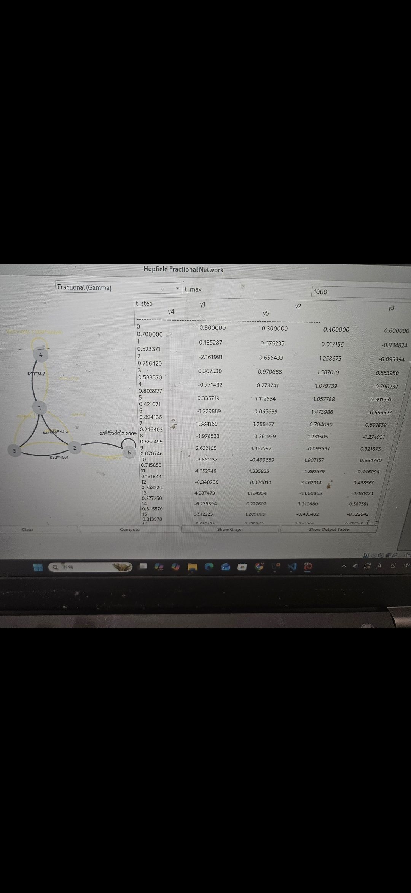
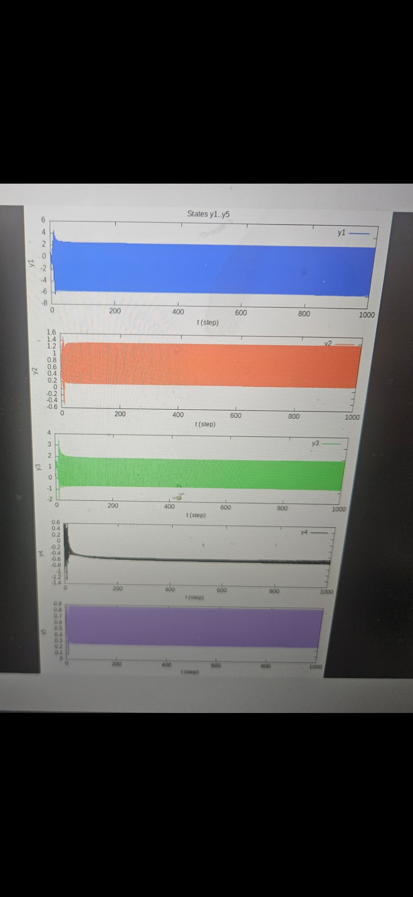

# QTproject
## Hopfield Fractional Network Simulator (Qt GUI)

This project is a **Qt-based GUI tool** for building and simulating **Hopfield neural networks** using:

- Ordinary Differential Equation (ODE) solver  
- Fractional-order (Gamma-based) solver

Users can visually design a 5-node network, assign activation functions (sin, tanh, ReLU), set custom weights, and run the simulation with real-time output.
## 📸 Demo / Screenshots

### Network Design & Simulation GUI
<p align="center">
  
</p>

### Simulation Output & Plot
<p align="center">
  
</p>

---

##  Features

-  **5-node network** (y₁ to y₅)
-  **Visual GUI node editor**
-  **Custom activation function per connection** (sin, tanh, relu)
-  **Choose solver:** ODE or Fractional (Gamma)
-  **Live output on right panel**
-  **Graph plotting** with Gnuplot
-  **Export equations** and **result table**

---

##  How It Works

```txt
1. User creates nodes (1–5) on canvas
2. Connect nodes and assign:
     - weight (sᵢⱼ)
     - function: sin / tanh / relu
3. Select:
     - Solver: ODE or Gamma
     - Time steps (t_max)
#  Known Issues & Performance Notes

## 1. Overview

This project implements a **network-based nonlinear dynamical system simulator** supporting:

- Classical **ODE (integer-order)** dynamics
- **Fractional-order (gamma kernel based)** dynamics
- User-defined network topology and nonlinear activation functions
- Qt-based GUI and visualization via gnuplot

During development, several **performance and numerical issues** were identified,
especially for large simulation time horizons.

---

## 2. Issue: Simulation Appears to Stop Around `t ≈ 500`

###  Observed Behavior

- When running the **fractional (Gamma) solver**, the simulation appears to freeze
  or stop progressing around **t ≈ 500**.
- The application does **not crash**, but the UI becomes unresponsive.
- Result files and plots are generated only after the full computation finishes.

###  Root Cause

This behavior is caused by **computational bottlenecks**, not by incorrect equations.

#### (1) Quadratic Time Complexity (O(t²))

The fractional solver (`runGamma`) uses a nested loop structure:

```text
for om = 1..T:
    for r = 1..om:
        accumulate weighted history contribution
This results in:

∑
𝑜
𝑚
=
1
𝑇
𝑜
𝑚
=
𝑇
(
𝑇
+
1
)
2
om=1
∑
T
​
 om= 
2
T(T+1)
​
 
Time steps (T)	Inner-loop iterations
500	~125,000
1000	~500,000
5000	~12,500,000

Combined with:

5 state variables

multiple network connections

gamma function evaluations

Qt event processing

…the computation becomes extremely slow beyond t ≈ 500.

(2) UI Thread Blocking
The solver currently runs on the Qt main (UI) thread

Heavy numerical computation blocks event processing

This makes the application appear frozen even though calculations are ongoing

3. Issue: Numerical Instability for Large t
⚠ Observed Risk
Direct use of std::tgamma() may lead to:

floating-point overflow

inf or NaN values

corrupted simulation results

 Cause
The gamma kernel weight is defined as:

𝑤
𝑘
=
Γ
(
𝑘
+
𝜈
)
Γ
(
𝑘
+
1
)
Γ
(
𝜈
)
w 
k
​
 = 
Γ(k+1)Γ(ν)
Γ(k+ν)
​
 
Direct evaluation of Γ(x) for large x is numerically unstable.

4. Current Limitations
Fractional solver performance degrades rapidly for t > 500

UI responsiveness decreases for large simulations

Fractional order ν is currently hard-coded

Parameter ranges are not fully constrained

5. Planned / Recommended Improvements
 Performance Improvements
Precompute gamma weights once instead of recalculating

Replace std::tgamma() with std::lgamma() for numerical stability

Reduce frequency of QCoreApplication::processEvents()

Move heavy computation to a background worker thread

 Numerical Stability
Restrict fractional order to 0 < ν < 1

Validate user input parameters

Add overflow / NaN detection

🖥 Usability Enhancements
Allow user-defined fractional order ν

Add progress indicator for long simulations

Display warnings for large time horizons

6. Important Note for Users
When using the fractional (Gamma) solver, computation time grows rapidly
with the simulation horizon t.

For interactive use, t ≤ 500 is recommended unless performance optimizations
are applied.

7. Summary
Apparent freezing at t ≈ 500 is a performance bottleneck, not a bug

The mathematical formulation is correct but computationally expensive

With optimization, simulations up to t = 5000 are feasible
     - Constants α₁, α₂, α₃
4. Qt internally simulates:
     - ODE: Euler method
     - Gamma: Caputo fractional approx.
5. Result shown on right (text table)
6. Optional: Graph plotted via Gnuplot
