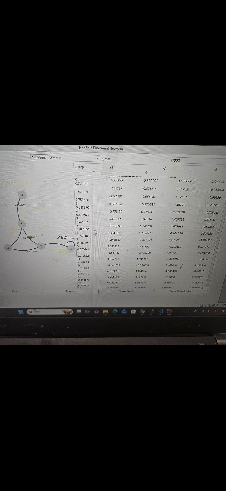
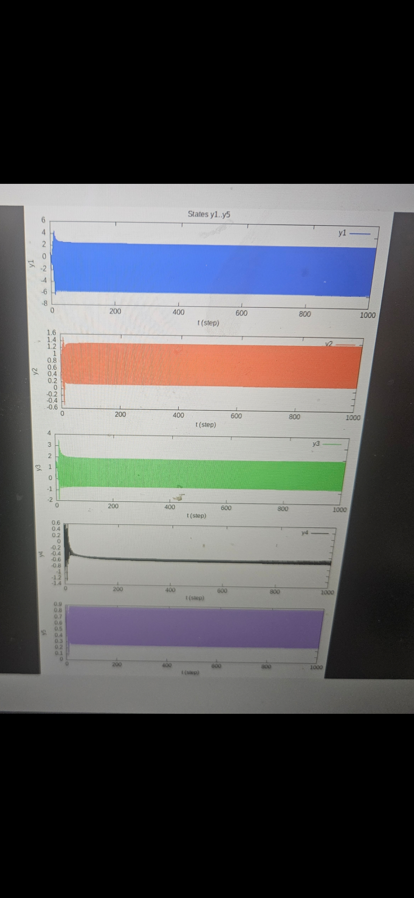

# QTproject
## Hopfield Fractional Network Simulator (Qt GUI)

This project is a **Qt-based GUI tool** for building and simulating **Hopfield neural networks** using:

- Ordinary Differential Equation (ODE) solver  
- Fractional-order (Gamma-based) solver

Users can visually design a 5-node network, assign activation functions (sin, tanh, ReLU), set custom weights, and run the simulation with real-time output.


# ButtonNetwork

Qt-based simulator for a five-node fractional-order network.

The application supports both Gamma-based fractional simulation and ODE simulation, together with network visualization, result export, parameter scanning, and plotting.

## Refactoring Goal

The original implementation places GUI handling, model parameters, numerical calculations, validation, result generation, and plotting mainly inside `ButtonNetwork`.

The purpose of this refactoring is to separate these responsibilities so that the numerical implementation can be inspected, validated, and debugged independently from the GUI.

This is especially important for the current C-reference validation, where small numerical differences between the reference C implementation and the Qt implementation are being investigated.

### Important Refactoring Rule

The first refactoring stage must **not change the numerical implementation**.

The existing:

- equations
- coefficients
- initial conditions
- Gamma/Beta calculations
- ODE calculations
- loop order
- accumulation order
- floating-point types
- mathematical functions
- solver parameters

should be preserved.

The first goal is **code separation, not algorithm modification or optimization**.

After separation, the numerical output will be compared with the original implementation before further architectural changes are introduced.

---

# Architecture

```text
                         ┌─────────────────────┐
                         │        GUI          │
                         │    ButtonNetwork    │
                         │                     │
                         │ buttons / dialogs   │
                         │ network drawing     │
                         └──────────┬──────────┘
                                    │
                     ┌──────────────┴──────────────┐
                     │                             │
              normal simulation             validation request
                     │                             │
                     ▼                             ▼
          ┌────────────────────┐       ┌─────────────────────┐
          │ FiveNodeParameters │◄──────│  ValidationRunner   │
          │                    │       │                     │
          │ alpha1/alpha2/     │       │ reference setup     │
          │ alpha3/nu          │       │ reference weights   │
          │ coefficients       │       │ validation workflow │
          │ initial values     │       └──────────┬──────────┘
          └─────────┬──────────┘                  │
                    │                             │
                    ▼                             │
          ┌────────────────────┐                  │
          │   FiveNodeModel    │◄─────────────────┘
          │                    │
          │ 5-node equations   │
          │ activation/gates   │
          └─────────┬──────────┘
                    │
                    ▼
          ┌────────────────────┐
          │       Solver       │
          │                    │
          │ Gamma calculation  │
          │ ODE calculation    │
          │ BG/Gamma weights   │
          └─────────┬──────────┘
                    │
              SimulationResult
                    │
          ┌─────────┴─────────────┐
          │                       │
          ▼                       ▼
 ┌──────────────────┐    ┌────────────────────┐
 │   ResultWriter   │    │    PlotManager     │
 │                  │    │                    │
 │ .dat             │    │ individual plots   │
 │ .csv             │    │ five-node plots    │
 │ tables           │    │ reference-style    │
 │ run information  │    │ plots / scans      │
 └──────────────────┘    └────────────────────┘
```

---

# Directory Structure

```text
ButtonNetwork/
│
├── main.cpp
├── ButtonNetwork.pro
├── README.md
│
├── gui/
│   ├── buttonnetwork.h
│   └── buttonnetwork.cpp
│
├── model/
│   ├── fivenodeparameters.h
│   ├── fivenodeparameters.cpp
│   ├── fivenodemodel.h
│   └── fivenodemodel.cpp
│
├── solver/
│   ├── solver.h
│   └── solver.cpp
│
├── validation/
│   ├── validationrunner.h
│   └── validationrunner.cpp
│
├── output/
│   ├── resultwriter.h
│   └── resultwriter.cpp
│
└── plot/
    ├── plotmanager.h
    └── plotmanager.cpp
```

---

# Component Responsibilities

## 1. GUI — `gui/ButtonNetwork`

`ButtonNetwork` is responsible only for user interaction and network visualization.

Responsibilities:

- create/edit network nodes
- create/edit connections
- mouse handling
- network drawing
- dialogs
- GUI controls
- collect user input
- request simulations
- display simulation status/results

The GUI should not contain the numerical Gamma or ODE implementation.

```text
User
  ↓
ButtonNetwork
  ↓
parameters / simulation request
  ↓
model + solver
```

---

## 2. Parameters — `model/FiveNodeParameters`

Contains the numerical parameters required by the five-node model.

Examples:

```text
alpha1
alpha2
alpha3
nu

initial conditions

y1(0)
y2(0)
y3(0)
y4(0)
y5(0)

coefficient/weight table

s12
s13
...
s52
```

This separation makes it possible to check model parameters independently from the equations and solver.

When debugging:

```text
Are the coefficients correct?
        ↓
FiveNodeParameters
```

---

## 3. Mathematical Model — `model/FiveNodeModel`

Contains the mathematical definition of the five-node system.

Responsibilities:

- five-node equations
- activation functions required by the model
- node-specific gate functions
- evaluation of the mathematical model

It should describe **what is being calculated**, not how the numerical solver iterates over time.

When debugging:

```text
Are the equations correct?
        ↓
FiveNodeModel
```

The model should not:

- draw GUI elements
- open dialogs
- generate plots
- write result files

---

## 4. Numerical Solver — `solver/Solver`

Contains the numerical algorithms.

Responsibilities:

### Gamma solver

- Gamma/Beta calculation
- BG weight calculation
- `om` loop
- `r` loop
- fractional accumulation
- initial-value addition

### ODE solver

- existing ODE implementation
- ODE integration

Both solver modes are retained.

```text
FiveNodeModel
      │
      ├─────────────┐
      ▼             ▼
 Gamma Solver    ODE Solver
      │             │
      └──────┬──────┘
             ▼
      SimulationResult
```

The first refactoring must preserve the existing mathematical expressions and evaluation order as closely as possible.

When debugging:

```text
Are BG/Gamma or accumulation calculations correct?
        ↓
Solver
```

---

## 5. Validation — `validation/ValidationRunner`

This component contains the validation workflow currently represented by `runAutoTestNode5Preset()`.

This is an important part of the project and is used to compare the Qt implementation with the reference C implementation.

Responsibilities include the existing validation configuration, such as:

```text
alpha1 = -2.2
alpha2 = selected validation value
alpha3 = 1.2
nu     = 0.70

steps  = 1000
solver = GAMMA
```

and the reference five-node coefficients used by the current validation workflow.

Typical validation values include:

```text
alpha2 = 0
alpha2 = 1
alpha2 = 2
alpha2 = 3
alpha2 = 6
```

Conceptually:

```text
ValidationRunner
       │
       │ validation parameters
       ▼
FiveNodeParameters
       │
       ▼
FiveNodeModel
       │
       ▼
Solver
       │
       ▼
SimulationResult
```

`ValidationRunner` defines the validation experiment.

It should **not implement a second independent copy of the Gamma solver**.

This ensures that normal simulation and reference validation can use the same numerical implementation.

When debugging:

```text
Are the reference validation conditions correct?
        ↓
ValidationRunner
```

---

## 6. Result Output — `output/ResultWriter`

Responsible only for saving calculated results.

Examples:

```text
result.dat
result_stream.csv
result_final.csv
table.txt
parameter/run information
```

Data flow:

```text
Solver
   │
   ▼
SimulationResult
   │
   ▼
ResultWriter
   │
   ├── DAT
   ├── CSV
   └── table
```

`ResultWriter` must not perform numerical simulation.

---

## 7. Plotting — `plot/PlotManager`

Responsible only for visualization of already calculated results.

The plotting component should support multiple output styles instead of forcing all results into one combined figure.

Planned plotting modes include:

### Individual state plots

```text
y1.png
y2.png
y3.png
y4.png
y5.png
```

### Combined five-node plot

```text
y_all.png
```

### Validation/reference-style plots

For example:

```text
alpha2_0.png
alpha2_1.png
alpha2_2.png
alpha2_3.png
alpha2_6.png
```

These plots can be formatted to reproduce the style used in the reference figures for direct comparison.

### Point / parameter-scan plots

The existing alpha2 scan and point-based visualization should also be handled by the plotting component.

Conceptually:

```text
SimulationResult
       │
       ▼
   PlotManager
       │
       ├── individual node plot
       ├── five-node plot
       ├── alpha2/reference plot
       └── point/scan plot
```

`PlotManager` must not calculate the network dynamics.

---

# Debugging Separation

The architecture is intended to make numerical debugging easier.

```text
Problem                           Component to inspect
----------------------------------------------------------
Wrong alpha/parameter          → FiveNodeParameters
Wrong coefficient              → FiveNodeParameters
Wrong equation                 → FiveNodeModel
Wrong activation/gate          → FiveNodeModel
Wrong BG/Gamma calculation     → Solver
Wrong accumulation             → Solver
Wrong ODE calculation          → Solver
Wrong validation setup         → ValidationRunner
Wrong saved numerical output   → ResultWriter
Wrong visualization            → PlotManager
Wrong GUI parameter transfer   → ButtonNetwork
```

This is particularly useful for investigating the current difference between the C reference and Qt results.

---

# Refactoring Strategy

The refactoring will be performed incrementally.

## Stage 1 — Separate Existing Code

Move the existing implementation into the new components without intentionally changing the numerical behavior.

Recommended order:

```text
1. FiveNodeParameters
        ↓
2. FiveNodeModel
        ↓
3. Solver
   ├── Gamma
   └── ODE
        ↓
4. ValidationRunner
        ↓
5. ResultWriter
        ↓
6. PlotManager
        ↓
7. Clean ButtonNetwork GUI code
```

At this stage:

> Do not optimize or redesign the numerical equations.

---

## Stage 2 — Numerical Regression Check

After separation, compare the refactored output with the output from the original implementation.

Use high-precision output:

```text
Original Release result.dat
            │
            │ 17-digit comparison
            ▼
Refactored Release result.dat
```

The purpose is to verify that code separation itself did not change the numerical trajectory.

This is especially important for numerically sensitive cases such as `alpha2 = 3`.

---

## Stage 3 — Remove Duplicate Calculation Paths

Only after Stage 2 passes should duplicated calculation logic be consolidated.

For example, the alpha2 scan should eventually reuse the same Gamma solver used by a normal Gamma simulation.

Conceptually:

```text
for each alpha2
        ↓
set alpha2
        ↓
Solver::runGamma(...)
        ↓
collect post-transient points
```

This avoids maintaining two different implementations of the same mathematical calculation.

---

## Stage 4 — Signal / Slot Separation

After numerical equivalence has been confirmed, the GUI and calculation flow can be connected using Qt signals and slots.

```text
ButtonNetwork
      │
      │ simulationRequested(parameters)
      ▼
Simulation Worker
      │
      ▼
Solver
      │
      │ simulationFinished(result)
      ▼
ButtonNetwork / PlotManager
```

---

## Stage 5 — Worker Thread

The numerical calculation can then be moved to a worker thread so that long simulations do not block the GUI.

```text
GUI THREAD
────────────────────────────

ButtonNetwork
      │
      │ signal
      ▼

WORKER THREAD
────────────────────────────

SimulationWorker
      │
      ▼
FiveNodeModel
      │
      ▼
Solver
      │
      │ result signal
      ▼

GUI THREAD
────────────────────────────

ButtonNetwork
      │
      ├── ResultWriter
      └── PlotManager
```

QML is not required.

The existing Qt Widgets GUI can continue to be used with `QObject`, signals/slots, and `QThread`.

---

# Current Validation Focus

The current investigation compares the Qt Gamma implementation with the professor's C reference implementation.

The main focus is the numerical behavior for different `alpha2` values, especially `alpha2 = 3`.

The refactoring is therefore designed to make the following independently inspectable:

```text
Validation configuration
        ↓
Parameters
        ↓
Five-node equations
        ↓
Gamma/BG calculation

## 📸 Demo / Screenshots

### Network Design & Simulation GUI
<p align="center">
  
</p>

### Simulation Output & Plot
<p align="center">
  
</p>

---

##  Features

-  **5-node network** (y₁ to y₅)
-  **Visual GUI node editor**
-  **Custom activation function per connection** (sin, tanh, relu)
-  **Choose solver:** ODE or Fractional (Gamma)
-  **Live output on right panel**
-  **Graph plotting** with Gnuplot
-  **Export equations** and **result table**

---

        ↓
Numerical result
        ↓
Saved data
        ↓
Plot
```

This separation should make it easier to identify whether a discrepancy originates from the model, numerical solver, validation configuration, output handling, or visualization.
